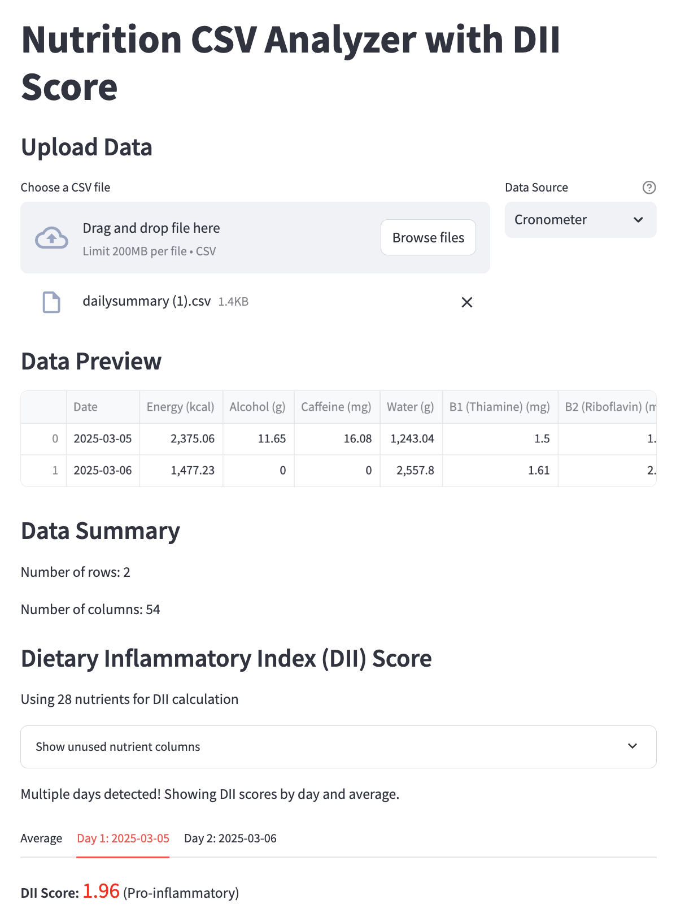
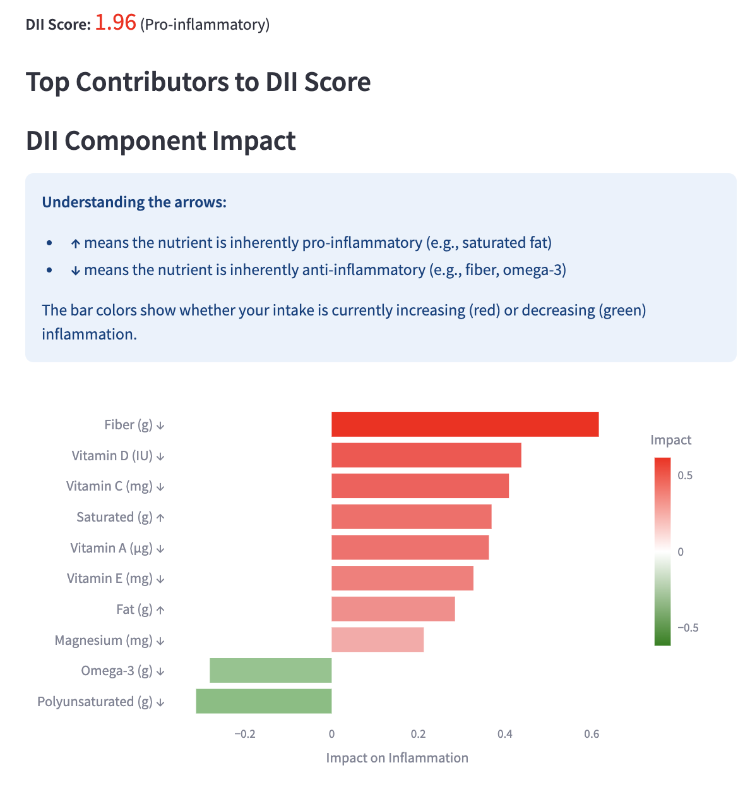
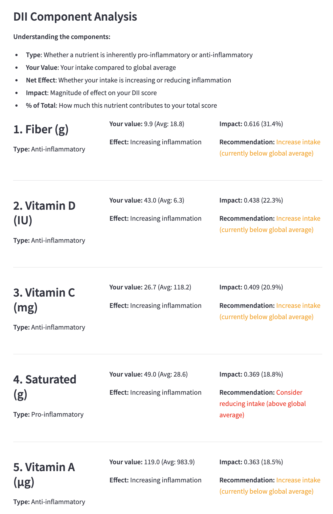
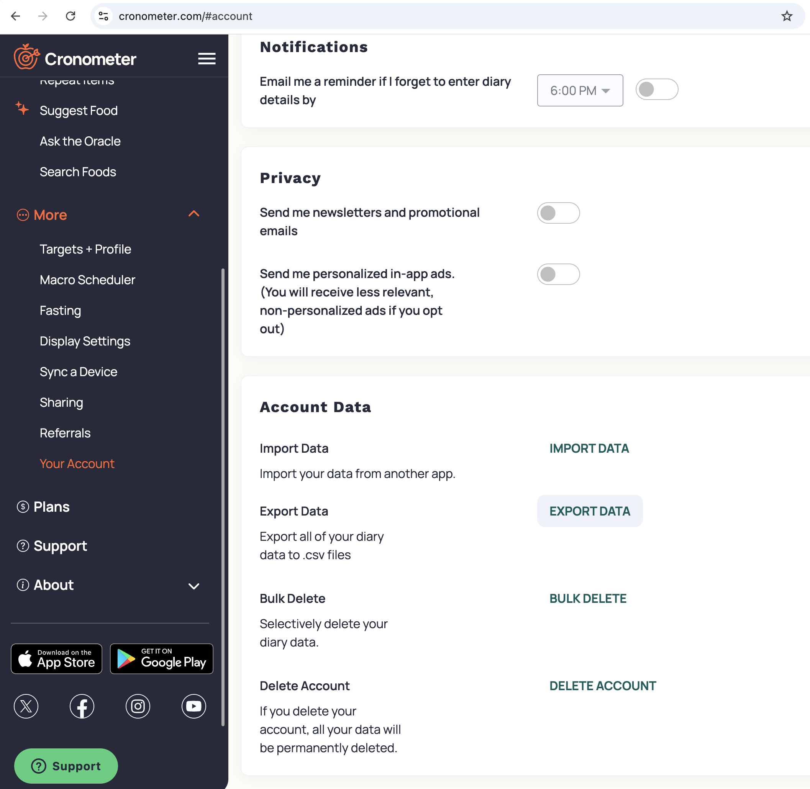

# Nutrition CSV Analyzer with DII Score

A Streamlit web application that allows users to upload nutrition data CSV files and get Dietary Inflammatory Index (DII) score analysis.

## Running the App

Go to https://nutrition-dii-calculator.streamlit.app/ to use the web app!


If you want to run your own copy of the app locally, then clone this repo and do:
```bash
streamlit run app.py
```

See the requirements.txt file for the required dependencies.

## Features

- Upload nutrition CSV files from Cronometer or MyFitnessPal
- View data preview and basic statistics


- Calculate Dietary Inflammatory Index (DII) score using the same formula as the DII.R file from https://github.com/jamesjiadazhan/dietaryindex.

- Color-coded score interpretation (anti-inflammatory, neutral, pro-inflammatory)


- Show top contributing nutrients to the score


- Multi-day support: automatically detects multiple days from the "Date" column and:
  - Calculates scores for each individual day
  - Calculates an average DII score across all days
  - Shows most impactful nutrients for both individual days and average


## DII Calculation Method

The app calculates DII scores following the same methodology as in the R implementation:
1. Takes nutrition values and compares them to global means
2. Calculates Z-scores for each nutrient
3. Converts Z-scores to percentiles
4. Weights percentiles by inflammatory effect scores
5. Sums all weighted scores to get the final DII

The higher the score, the more pro-inflammatory the diet. Negative scores indicate an anti-inflammatory diet.

## Supported CSV Formats

### Cronometer Format
The app supports Cronometer CSV exports with these columns (if available):
- Date (for multiple day tracking)
- Energy (kcal)
- Alcohol (g)
- Caffeine (mg)
- B1 (Thiamine) (mg)
- B2 (Riboflavin) (mg)
- ... and other nutritional values

You can export your data from cronometer by going to https://cronometer.com/#account
->  More -> Your Account -> Account Data -> Export Data -> export daily nutrition



### MyFitnessPal Format
The app also supports MyFitnessPal CSV exports with:
- Date
- Meal (Breakfast, Lunch, Dinner, Snacks)
- Calories
- Macronutrients and micronutrients

MyFitnessPal data is automatically aggregated by day from the meal-level entries to calculate your daily DII score.

You can export your data from myfitnesspal by going to https://www.myfitnesspal.com/reports/export
-> reports -> export (go with the default "Weight").
After exporting you’ll get an email with a csv file, which you can upload to the streamlit app.


